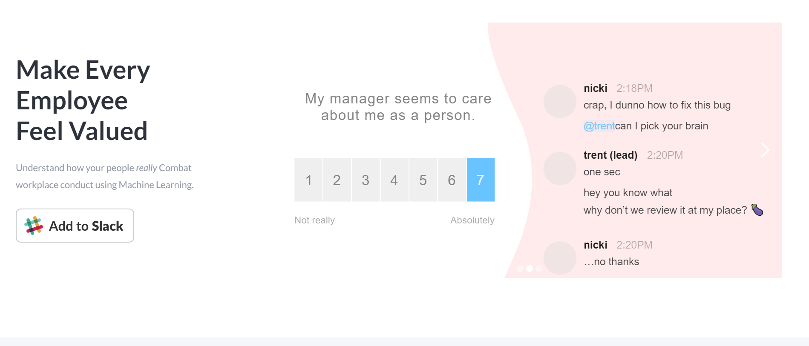

# SlackHR

  

Combating workplace abusive conduct using Machine Learning.
**Make every employee feel Valued.** 

  

Leveraging the latest trends in natura llanguage processing, SlackHR is an application that looks at communication data from Slack workspaces and determines threat severity of messages to give companies warning of potential problems within appropriate behavior. The application was made in mind of harassment or unprofessional attitudes at work. SlackHR will allow companies to receive feedback based on conversations had in public Slack channels or even direct messages to get a feel of what is going on within the organization. Machine learning,cloud integration, third-party (Slack) integration, and a React web stack other technical aspects were considered and implemented to make this project possible.


## Usage

  ```console
	#Add your Slack API Token with
	set SLACK_API_TOKEN=''
	pip3 install BackendScripts/requirements.txt

	sudo docker build -t SlackHR .  #Frontend container
	python3 API/cloudmysql.py
```

## Background


Every organization has a legal department that makes sure that the company is obeying all the legal laws and regulations. Nowadays, most companies include workplace ethics training so the employees get familiarised with the ethical stance of the company, including advice and instructions on reporting unethical behavior. It's really important for an organization to listen to its employees and the legal/HR department of a large organization receives hundreds of complaints every day.

Especially due to the recent events of the Coronavirus, companies are shifting their communication to online methods like Slack so it is important to monitor messages to see if people are behaving professionally and flag messages that are not. The process involves reading the complaints manually and assigning the severity of each complaint, so the HR department can take the action accordingly. Instead of manually reading the complaints, our solution will classify each message and categorize the kind of message using ‘Deep Learning - Natural Language Processing’ so that the legal department can quickly be alerted about different priority issues to take action.

  

#### Example

##### Input: Text from Slack

  

* Well my apologies, I guess I didn't read all the rules of xyz carefully you fucking retarded big long dick nose no culture norwegian piece of shit.

* god i hate this guy

* My coworker talked bad about me behind my back

  

##### Output

  

* A message can fall under **'obscene', 'insult', 'toxic', 'severe_toxic', 'identity_hate',' threat'** category, so each message has one of these label or all label. For ex: My coworker tried to bribe me comes under the **'obscene'** label.

  
 
## ML Model
### TFIDF Calculation

  

TFIDF is a information retrival technique using in Google search engine. It "weight's" a term frequency and it's inverse document frequency. So each word/term has its TF score and IDF score.

TF * IDF = higher this value means the word has rare occuances and vice versa.

  

W(t,d) = TF(t,d) log[N/DF(t)]

t --> term

D --> document

N --> total documents

DF(t) --> number of documents contains term 't'

TF(t,d) --> number of ocuurances of term 't' in documents 'd'

  

### Multiclass Multilabel Classification Using NLP:

  

For each slack message or communication which falls under compliance category, we are categorizing each message in 6 classes.

**'obscene', 'insult', 'toxic', 'severe_toxic', 'identity_hate', 'threat'.** The probablity of the message can be in two classes or all or one or non.

  

## Architecture Diagram

  


## Technology Stack

* Client-side: React, Redux

* Server-side: Python, Flask, Cloud SQL

* Deep Learning - Natural Language Processing, TFIDF

* Deployment: Kubernetes
